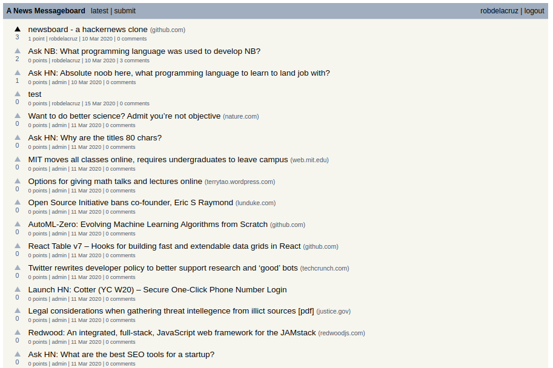
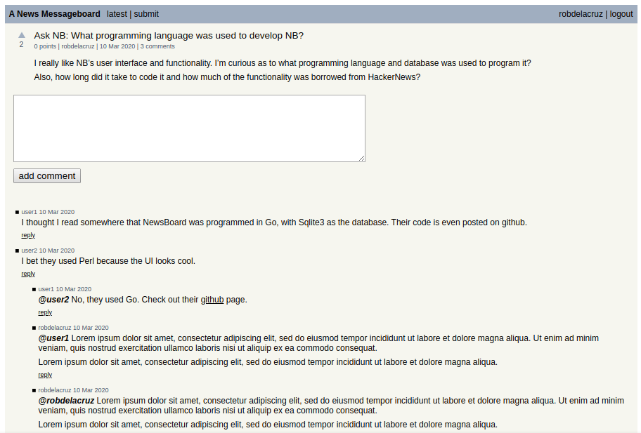

## About newsboard

newsboard is a bulletin board for posting stories and links. Inspired by HackerNews.

- Submit stories and links.
- Reply to stories.
- Multiple users.
- MIT License

## Build and Install

    $ make dep
    $ make
    $ nb -i news.db

    Run 'nb news.db' to start the web service.

newsboard uses a single sqlite3 database file to store all submissions, users, and site settings.

## Screenshots

## Contact
    Twitter: @robcomputing
    Source: http://github.com/robdelacruz/newsboard

